<picture>
  <source media="(prefers-color-scheme: dark)" srcset="dark.svg">
  <source media="(prefers-color-scheme: light)" srcset="light.svg">
  
</picture>

# Hi 👋 I'm Vaibhav R

### AI/ML Engineer

I'm passionate about Artificial Intelligence, Machine Learning, and building intelligent systems.

---

## 🛠 Tech Stack

- Python
- TensorFlow
- PyTorch
- Scikit-learn
- OpenCV
- NumPy
- Pandas
- Docker
- Git
- Linux
- Flask
- FastAPI

---

## 📫 Connect with me

- GitHub: https://github.com/vaibhav-pyy
- LinkedIn: https://www.linkedin.com/in/vaibhav-pyy/
- X: https://x.com/Vaibhav_pyy
